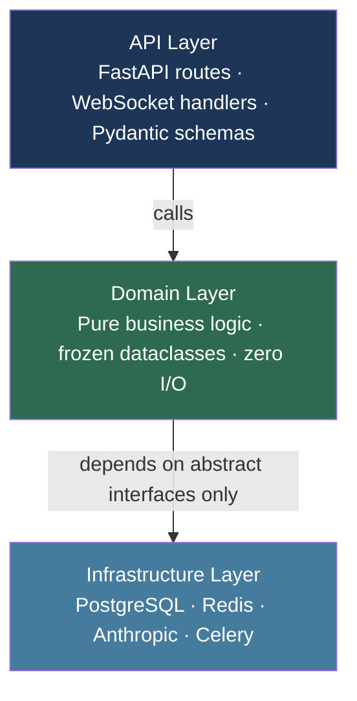

# Dependency Rule

Dependencies point **inward only**. The domain layer has zero knowledge of any framework or infrastructure.

## Why this matters

| If domain depends on... | Problem |
|---|---|
| PostgreSQL | Can't test without a running database |
| FastAPI | Can't reuse domain logic in CLI tools or background jobs |
| Anthropic SDK | Can't swap LLM provider without touching business logic |

**The fix:** Domain defines *interfaces* (abstract base classes). Infrastructure *implements* them. Domain never imports from infrastructure.
