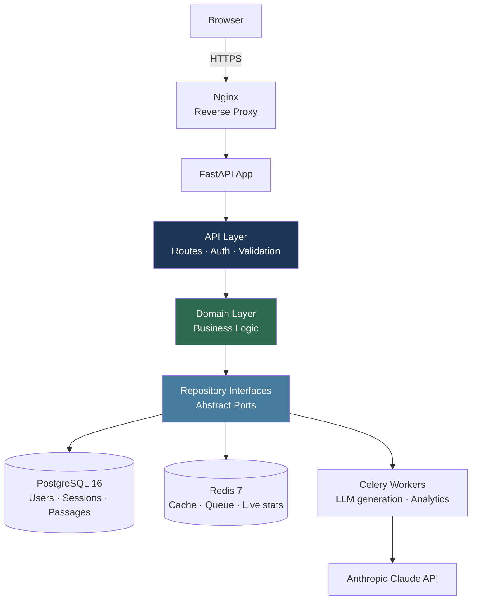

# System Overview

## Component responsibilities

| Component | Responsibility |
|---|---|
| Nginx | TLS termination, reverse proxy, static assets |
| FastAPI | HTTP routing, request validation, auth middleware |
| Domain Layer | Business rules — adaptation engine, scoring, skill updates |
| Repository interfaces | Abstract data access — domain never touches SQL directly |
| PostgreSQL | Source of truth for all persistent data |
| Redis | Passage cache (TTL 24h), rate limiting, live session stats |
| Celery | Async passage generation — decouples LLM latency from request path |
