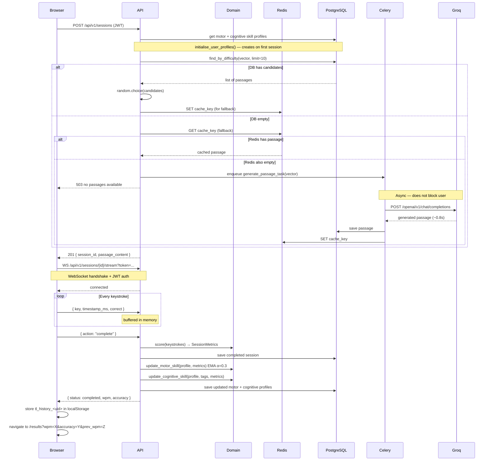

# Request Flow — Full Typing Session

## Key flow invariants

| Invariant | Where enforced |
|---|---|
| Session stays STARTED after WS disconnect | `handler.py` — no state change on disconnect |
| Same user cannot own another user's session | `session.user_id != user_id` → 404 |
| Completed/abandoned session cannot be re-completed | `session.complete()` raises if not STARTED |
| Passage selection is random, not deterministic | `random.choice(candidates)` |
| Cache is fallback only, not primary path | DB queried first on every request |
| JWT refreshed before expiry | Frontend 14-min interval, 15-min token TTL |
