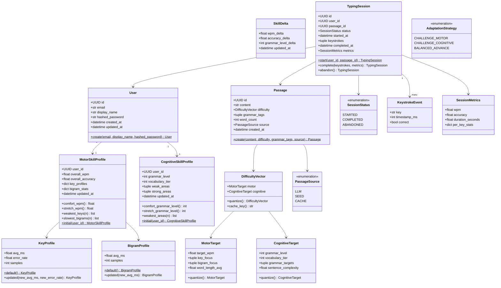

# Domain Model

All domain models are **frozen dataclasses** — immutable, zero external dependencies.

## Design decisions

| Decision | Choice | Reason |
|---|---|---|
| `frozen=True` | Yes on all models | Domain facts are immutable — `session.complete()` returns a *new* session |
| IDs | `UUID` | No info leakage, safe across services |
| `datetime` | Always UTC-aware | `S` rules enforce this; naive datetimes cause bugs at timezone boundaries |
| Lists vs tuples | `tuple` for ordered immutable sequences | Frozen dataclasses can't contain mutable `list` fields |
| State transitions | Methods return new instances | `session.complete()` enforces `STARTED → COMPLETED` invariant |
