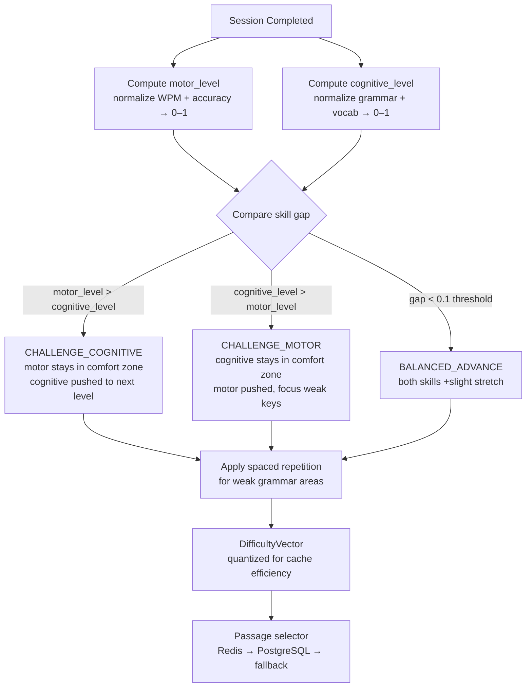

# Adaptation Algorithm

The intellectual core of TypeLingo. Selects the next passage by challenging whichever skill is weaker.



## Skill update after session (EMA)

```
new_value = alpha * observation + (1 - alpha) * old_value
alpha = 0.3
```

- High alpha (0.3) → recent sessions matter more
- Low alpha → smoother but slower to adapt
- Applied to: WPM, accuracy, per-key avg_ms, per-key error_rate

## Motor vs cognitive error disentanglement

When a user errors on a word — is it a typo (motor) or confusion (cognitive)?

| Signal | Motor error | Cognitive error |
|---|---|---|
| Timing | Fast keystroke + quick backspace (<500ms) | Long pause before the word |
| Pattern | Random character substitution | Consistent wrong word (e.g. "their" → "they're") |
| Context | Key appears in weak_keys profile | Grammar tag appears in weak_areas |
