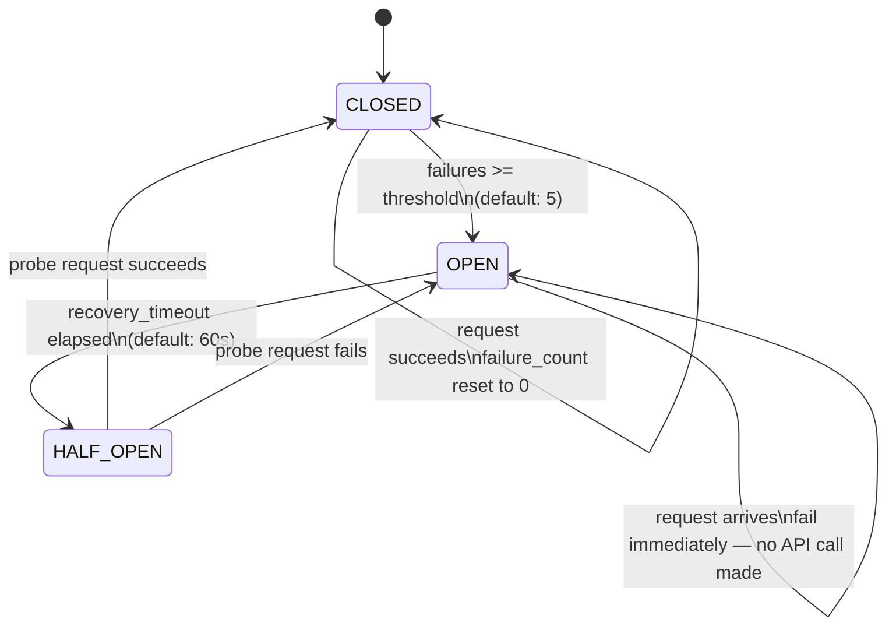

# Circuit Breaker — LLM API

Wraps all calls to the Anthropic API. Prevents cascading failures when the LLM is down.



## Why this matters

Without a circuit breaker, every user request waits for the LLM timeout (potentially 30s) before failing. Under load, threads pile up and take down the whole app.

With it:
- **OPEN state**: requests fail in <1ms — no API call made
- App stays responsive and serves from cache/fallback
- Self-heals when LLM recovers (HALF_OPEN probe)

## Graceful degradation chain

```
LLM API down → circuit OPEN
    └─→ serve from Redis cache
    └─→ serve from PostgreSQL passage store
    └─→ serve from pre-seeded fallback corpus
    └─→ increment circuit_breaker_state metric → alert fires
```
