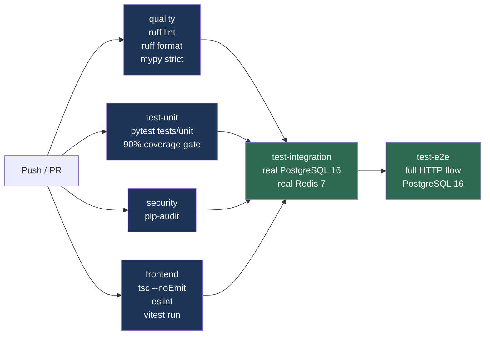
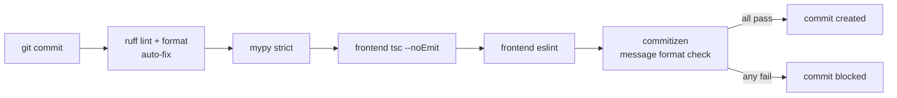

# CI/CD Pipeline



## Pre-commit hooks (local, before push)



## Conventional commit format

```
<type>(<scope>): <description>

Types: feat · fix · refactor · test · docs · chore · perf
```

Examples:
- `feat(domain): add TypingSession state machine`
- `fix(scoring): exclude backspaced chars from WPM`
- `test(adaptation): add balanced advance scenario`
- `chore(ci): add frontend quality gate`

## Job rationale

| Job | Runs | Why |
|---|---|---|
| quality | Always | Cheap — fail fast on lint before spending on tests |
| test-unit | Always | No infra needed — runs in <3s |
| security | Always | Independent of code correctness |
| frontend | Always | TypeScript type check + ESLint + Vitest component tests |
| test-integration | After all four pass | Spins up Postgres + Redis — expensive |
| test-e2e | After integration | Full HTTP user flow — requires clean DB state |
