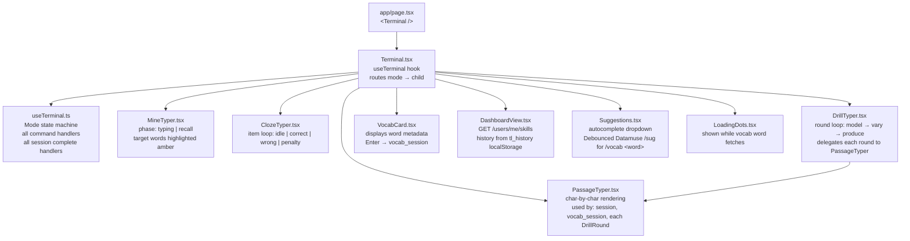
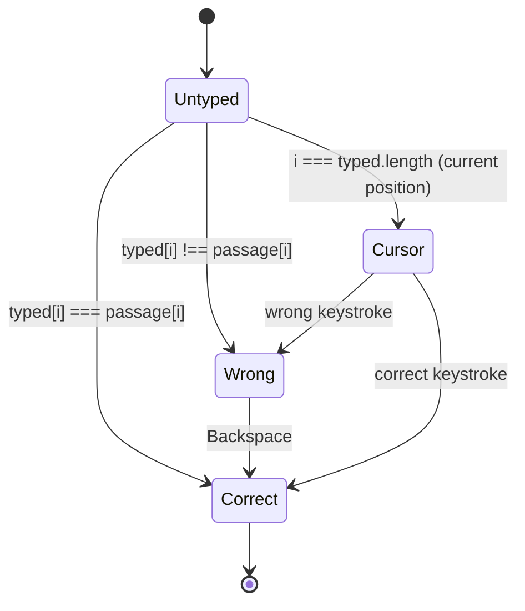
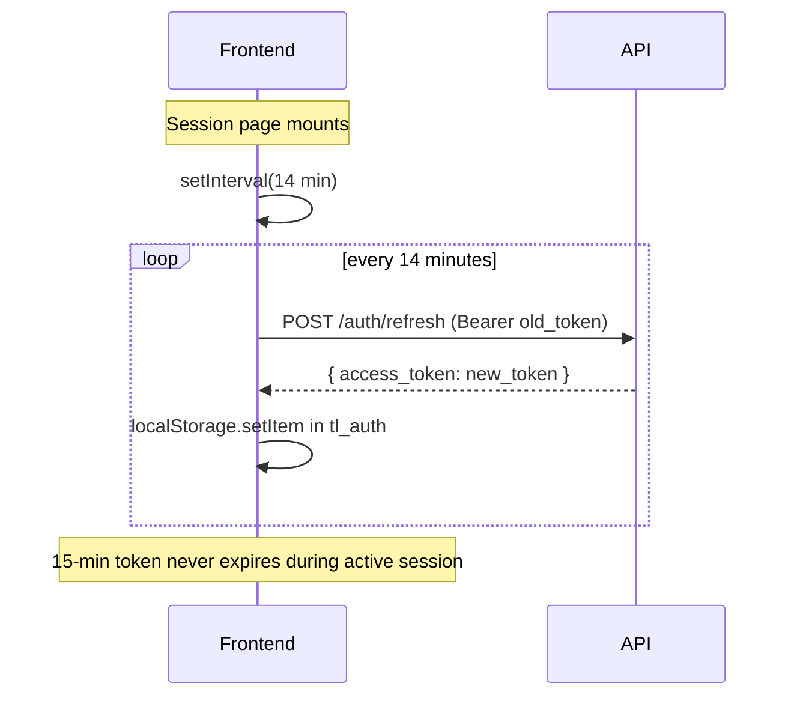

# Frontend Flow

Terminal-mode state machine, user journeys, localStorage layout, and component hierarchy for the single-page Next.js terminal UI.

## Terminal mode state machine

```mermaid
stateDiagram-v2
    [*] --> idle : page load (boot sequence)

    idle --> login_email     : /login
    idle --> reg_email       : /register
    idle --> idle            : /guest → JWT obtained → if cefrLevel set
    idle --> level_select    : /guest → JWT obtained → cefrLevel unset
    idle --> session         : /session [random dispatch → regular fallback]
    idle --> session_mine    : /session mine (or random dispatch)
    idle --> session_cloze   : /session cloze (or random dispatch)
    idle --> session_drill   : /session drill (or random dispatch)
    idle --> vocab_card      : /vocab or /vocab &lt;word&gt;
    idle --> dashboard       : /dashboard

    login_email     --> login_password : valid email entered
    login_email     --> idle           : Ctrl+C
    login_password  --> idle           : login success → cefrLevel set
    login_password  --> level_select   : login success → cefrLevel unset
    login_password  --> idle           : invalid credentials
    login_password  --> idle           : Ctrl+C

    reg_email       --> reg_name       : valid email entered
    reg_email       --> idle           : Ctrl+C
    reg_name        --> reg_password   : name entered
    reg_name        --> idle           : Ctrl+C
    reg_password    --> idle           : register success → cefrLevel set
    reg_password    --> level_select   : register success → cefrLevel unset
    reg_password    --> idle           : registration failed
    reg_password    --> idle           : Ctrl+C

    level_select    --> idle           : valid CEFR level entered (A1–C2)
    level_select    --> level_select   : invalid level → re-prompt
    level_select    --> idle           : Ctrl+C

    session         --> idle           : passage complete (onComplete)
    session         --> idle           : Esc / Ctrl+C → abandon

    session_mine    --> idle           : typing + recall complete (onComplete)
    session_mine    --> idle           : Esc / Ctrl+C → abandon

    session_cloze   --> idle           : all items complete (onComplete)
    session_cloze   --> idle           : Esc / Ctrl+C → abandon

    session_drill   --> idle           : 3 rounds complete (onComplete)
    session_drill   --> idle           : Esc / Ctrl+C → abandon

    vocab_card      --> vocab_session  : Enter
    vocab_card      --> idle           : Esc / Ctrl+C

    vocab_session   --> idle           : sentence typed (onComplete) → word recorded
    vocab_session   --> idle           : Esc / Ctrl+C

    dashboard       --> idle           : Esc / Enter / Ctrl+C
```



## User journey: first visit → auth → level select → usage loop

```mermaid
flowchart TD
    Boot[Page load\nboot sequence printed] --> Choice{Auth choice}

    Choice -->|/guest| GuestJWT[POST /auth/guest\nJWT 7-day TTL]
    Choice -->|/login| LoginFlow[login_email → login_password\nPOST /auth/login]
    Choice -->|/register| RegFlow[reg_email → reg_name → reg_password\nPOST /auth/register]

    GuestJWT --> LevelCheck{tl_cefr set?}
    LoginFlow -->|success| LevelCheck
    RegFlow -->|success| LevelCheck

    LevelCheck -->|no| LevelSelect[level_select mode\nA1–C2 choice\nPOST /assess/complete]
    LevelCheck -->|yes| UsageLoop

    LevelSelect --> UsageLoop

    UsageLoop[idle — ready] --> Session[/session → session mode]
    UsageLoop --> Vocab[/vocab → vocab_card]
    UsageLoop --> Dashboard[/dashboard → stats view]

    Session --> Results[Results shown in terminal\nwpm / accuracy / grade]
    Results --> UsageLoop

    Vocab --> VocabPractice[vocab_session\ntype example sentence]
    VocabPractice --> UsageLoop

    Dashboard --> UsageLoop
```

## localStorage keys

| Key | Contents | Set by | Read by |
|---|---|---|---|
| `tl_auth` | `{email, name, token, isGuest}` JSON | login / register / /guest | `useTerminal` on mount |
| `tl_cefr` | CEFR level string, e.g. `"B1"` | level_select confirm | `useTerminal` on mount |
| `tl_history` | `[{wpm, accuracy, passage, passageSnippet}]` array | `commitResult` on session complete | `DashboardView` |

Note: `tl_history` is global (not user-namespaced). `tl_auth` carries the JWT from which the user UUID is decoded when needed (e.g. `userIdFromToken` in `api.ts`).

## Component hierarchy



## Character rendering state machine (PassageTyper)



## Token refresh strategy


