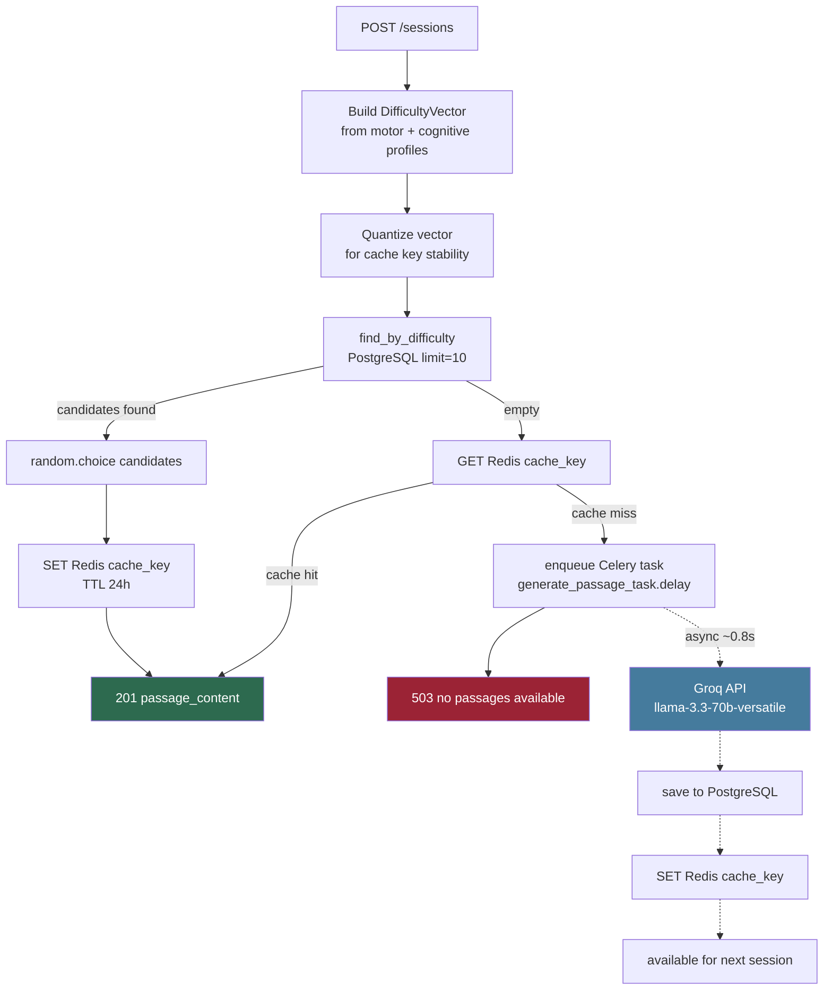
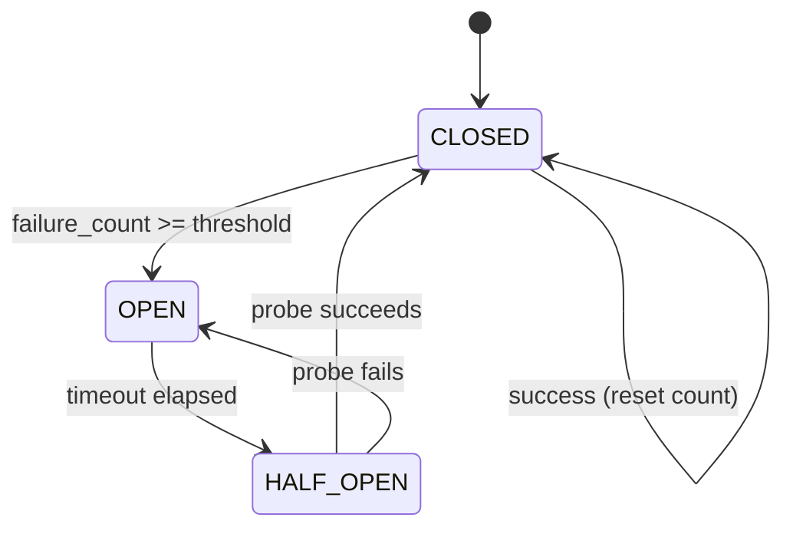

# Passage Pipeline

How TypeLingo selects, generates, and caches passages.

## Difficulty vector quantization

Before using a vector as a cache key, values are rounded to reduce the key space:

| Field | Quantization |
|---|---|
| `target_wpm` | rounded to nearest 5 |
| `grammar_level` | rounded to nearest 1 (already int) |
| `vocabulary_tier` | rounded to nearest 1 (already int) |

This means a user at 37.2 WPM and a user at 38.9 WPM share the same cache key (both → 40).
Higher cache hit rate at the cost of less precise targeting.

## Circuit breaker around Groq

When OPEN: Celery task raises `CircuitBreakerOpen` immediately — no HTTP call made.
When HALF_OPEN: one probe attempt; if Groq responds, circuit closes.

## Passage sources

| Source | When used |
|---|---|
| `SEED` | Pre-seeded passages via `make seed` (5 passages, levels 1–4) |
| `LLM` | Groq-generated, difficulty-targeted, stored permanently |
