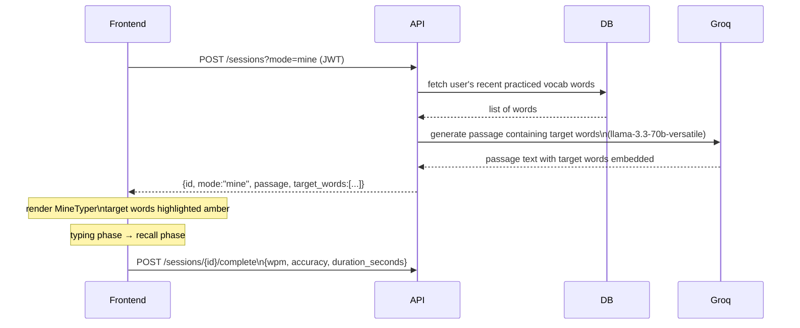
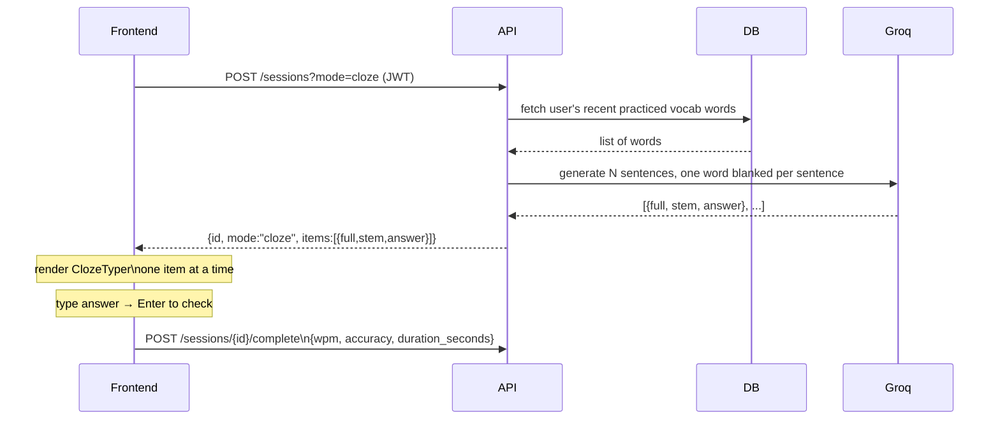
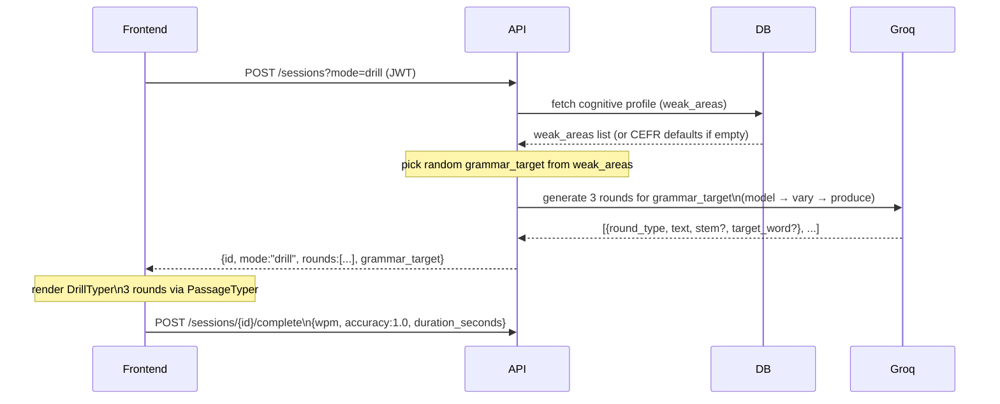
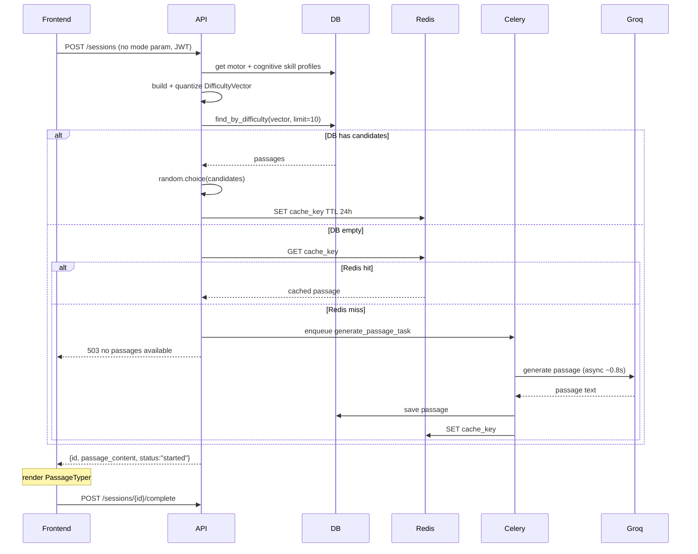
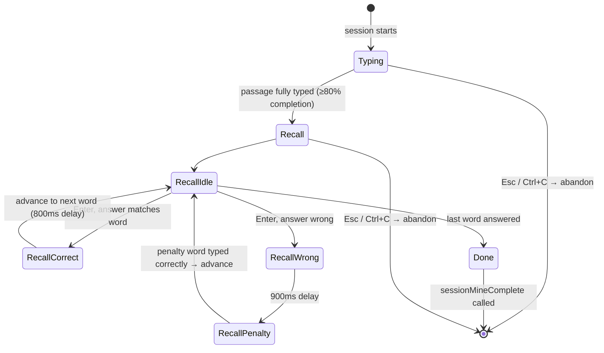
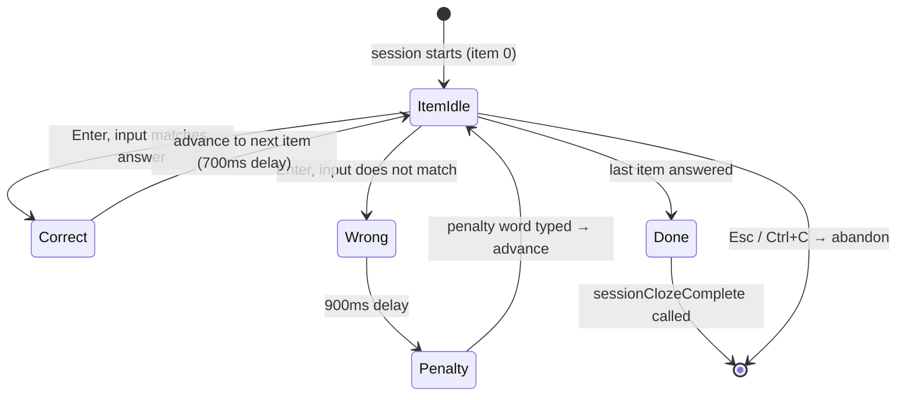
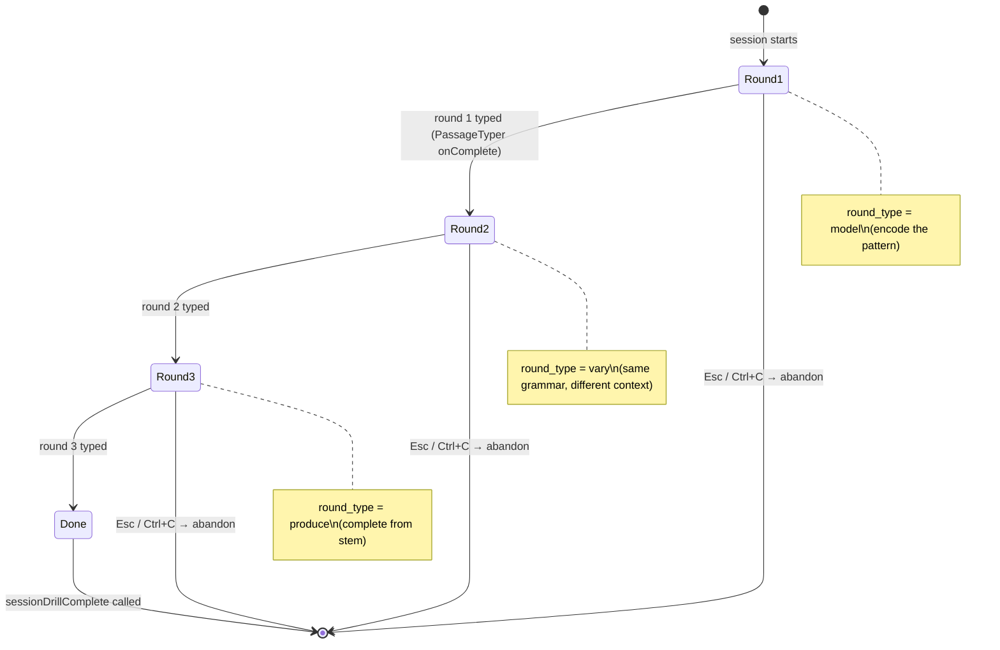

# Session Modes

How `/session` dispatches to one of four modes, what each mode fetches and generates, and what results are shown on completion.

## Dispatch flowchart

```mermaid
flowchart TD
    Cmd["/session [arg]"] --> ArgCheck{arg present?}

    ArgCheck -->|no arg| Random["random.choice(['mine','cloze','drill'])"]
    ArgCheck -->|mine| Mine[mode = mine]
    ArgCheck -->|cloze| Cloze[mode = cloze]
    ArgCheck -->|drill| Drill[mode = drill]
    ArgCheck -->|unknown| Error["error: usage hint shown\nstay in idle"]

    Random --> Dispatch[POST /api/v1/sessions?mode=&lt;mode&gt;]
    Mine   --> Dispatch
    Cloze  --> Dispatch
    Drill  --> Dispatch

    Dispatch -->|400| NoVocab["error: practice /vocab first\n(mine/cloze require practiced words)"]
    Dispatch -->|503| NoPassage["error: generation queued\ntry again shortly"]
    Dispatch -->|200| Route{response.mode}

    Route -->|mine|  MineUI[session_mine mode]
    Route -->|cloze| ClozeUI[session_cloze mode]
    Route -->|drill| DrillUI[session_drill mode]
    Route -->|undefined| RegUI[session mode\nregular passage]
```

## Data flow: mine mode



## Data flow: cloze mode



## Data flow: drill mode



## Data flow: regular session



## UX state machine: mine



## UX state machine: cloze



## UX state machine: drill



## Results output per mode

| Mode | Metrics shown | Stored in tl_history |
|---|---|---|
| regular | wpm, accuracy, grade (S/A/B/C) | yes |
| mine | wpm, accuracy, words mined list | yes |
| cloze | score (N/total), grade (S/A/B/C) | no |
| drill | grammar_target, rounds complete (3/3), wpm | no |
