# Terminal State Machine

Complete state machine for the TypeLingo terminal UI. Every transition is labelled with its trigger. Every mode has a cancel path back to idle.

```mermaid
stateDiagram-v2
    [*] --> idle : page load

    %% ── Auth: login ──────────────────────────────────────────────────────────
    idle --> login_email : /login (not already signed in)

    login_email --> login_password : Enter (valid email)
    login_email --> login_email    : Enter (invalid email — re-prompt)
    login_email --> idle           : Ctrl+C / empty submit

    login_password --> idle         : Enter → POST /auth/login success, cefrLevel set
    login_password --> level_select : Enter → POST /auth/login success, cefrLevel unset
    login_password --> idle         : Enter → invalid credentials (error shown)
    login_password --> idle         : Ctrl+C / empty submit

    %% ── Auth: register ───────────────────────────────────────────────────────
    idle --> reg_email : /register (not already signed in)

    reg_email --> reg_name      : Enter (valid email)
    reg_email --> reg_email     : Enter (invalid email — re-prompt)
    reg_email --> idle          : Ctrl+C / empty submit

    reg_name --> reg_password   : Enter (name accepted)
    reg_name --> idle           : Ctrl+C / empty submit

    reg_password --> idle         : Enter → POST /auth/register success, cefrLevel set
    reg_password --> level_select : Enter → POST /auth/register success, cefrLevel unset
    reg_password --> idle         : Enter → registration failed (error shown)
    reg_password --> idle         : Ctrl+C / empty submit

    %% ── Guest ────────────────────────────────────────────────────────────────
    idle --> idle         : /guest → POST /auth/guest success, cefrLevel already set
    idle --> level_select : /guest → POST /auth/guest success, cefrLevel unset

    %% ── Level select ─────────────────────────────────────────────────────────
    level_select --> idle         : Enter (valid A1–C2) → POST /assess/complete
    level_select --> level_select : Enter (invalid level — re-prompt)
    level_select --> idle         : Ctrl+C / empty submit

    %% ── Sessions ─────────────────────────────────────────────────────────────
    idle --> session       : /session → dispatch returns regular (no mode field)
    idle --> session_mine  : /session mine  OR  /session → random dispatch → mine
    idle --> session_cloze : /session cloze OR  /session → random dispatch → cloze
    idle --> session_drill : /session drill OR  /session → random dispatch → drill

    session       --> idle : passage fully typed (≥80%) → results shown
    session       --> idle : Esc / Ctrl+C → POST /sessions/{id}/abandon

    session_mine  --> idle : typing complete + all recall items answered
    session_mine  --> idle : Esc / Ctrl+C → POST /sessions/{id}/abandon

    session_cloze --> idle : all cloze items answered
    session_cloze --> idle : Esc / Ctrl+C → POST /sessions/{id}/abandon

    session_drill --> idle : all 3 drill rounds typed
    session_drill --> idle : Esc / Ctrl+C → POST /sessions/{id}/abandon

    %% ── Vocab ────────────────────────────────────────────────────────────────
    idle --> vocab_card : /vocab → GET /vocab/next
    idle --> vocab_card : /vocab &lt;word&gt; → GET /vocab/next?word=&lt;word&gt;

    vocab_card --> vocab_session : Enter
    vocab_card --> idle          : Esc / Ctrl+C

    vocab_session --> idle : sentence typed → POST /vocab/practiced
    vocab_session --> idle : Esc / Ctrl+C (word not recorded)

    %% ── Dashboard ────────────────────────────────────────────────────────────
    idle --> dashboard : /dashboard (signed in)

    dashboard --> idle : Esc / Enter / Ctrl+C

    %% ── Utility commands (stay in idle) ──────────────────────────────────────
    idle --> idle : /help  → print command list
    idle --> idle : /clear → clear output
    idle --> idle : /logout → clear tl_auth
    idle --> idle : /vocab list → GET /vocab/list → print table
    idle --> idle : unknown command → error line
```

## Prompt label per mode

| Mode | Prompt shown |
|---|---|
| `idle` | `>` |
| `login_email` | `email` |
| `login_password` | `password` |
| `reg_email` | `email` |
| `reg_name` | `name` |
| `reg_password` | `password` |
| `level_select` | `level` |
| `session` / `session_*` | input bar hidden — typer component takes over |
| `vocab_card` | input bar hidden — keydown handler on document |
| `vocab_session` | input bar hidden — PassageTyper takes over |
| `dashboard` | input bar hidden — keydown dismisses |

## Keyboard shortcuts (global)

| Key | Context | Action |
|---|---|---|
| `/` | idle, input bar hidden | open input bar, pre-fill `/` |
| `Tab` | idle, input starts with `/` | autocomplete command or vocab word |
| `Enter` | any input mode | submit current value |
| `Ctrl+C` | any mode | cancel → idle (abandon session if active) |
| `Esc` | idle | close input bar |
| `Esc` | any session / vocab_session | cancel → idle |
| `Esc` | dashboard | dismiss → idle |
| `Enter` | vocab_card | start practice → vocab_session |
| `Esc` | vocab_card | skip card → idle |
| `Enter` | dashboard | dismiss → idle |
