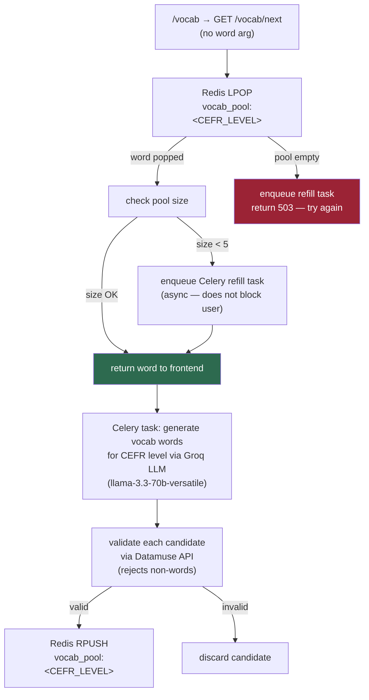
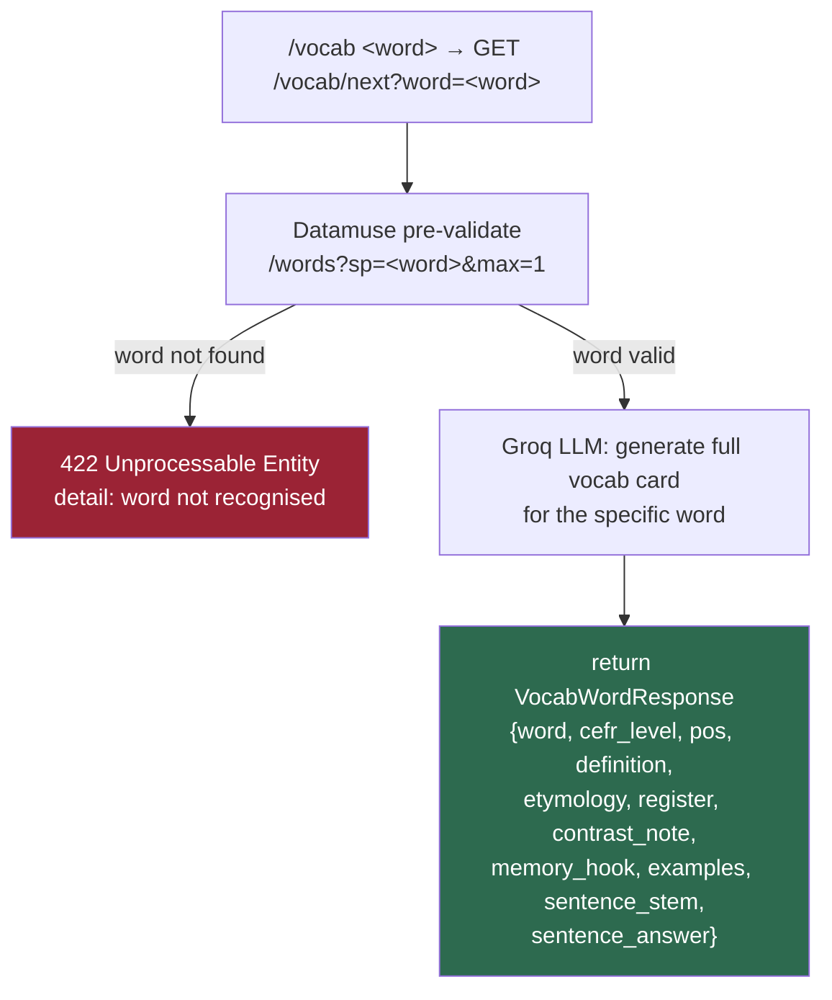
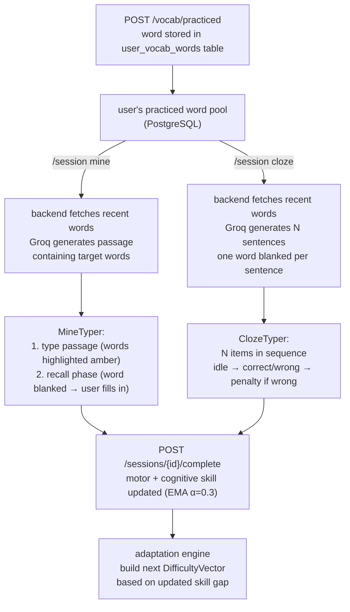
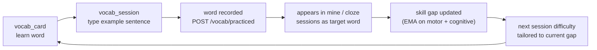

# Vocab & Learning Loop

How vocabulary words are fetched, generated, validated, and fed back into session modes as reinforcement.

## /vocab command flow (pool-based)



## /vocab \<word\> flow (on-demand specific word)



## Vocab card → practice → record cycle

```mermaid
sequenceDiagram
    participant User
    participant Terminal
    participant API
    participant Redis

    User->>Terminal: /vocab (or /vocab &lt;word&gt;)
    Terminal->>API: GET /vocab/next [?word=X]
    API->>Redis: LPOP vocab_pool:&lt;CEFR&gt; (pool path)
    Redis-->>API: word data
    API-->>Terminal: VocabWordResponse

    Note over Terminal: mode → vocab_card\nshow: word, POS, CEFR, definition,\netymology, register, contrast note,\nmemory hook, examples

    User->>Terminal: Enter
    Note over Terminal: mode → vocab_session\nshow: word + definition header\nfirst example sentence with word blanked

    User->>Terminal: type example sentence
    Note over Terminal: PassageTyper — char-by-char\nblank word revealed as user types

    Terminal->>Terminal: onComplete called
    Terminal->>API: POST /vocab/practiced\n{word, cefr_level, pos}
    Note over Terminal: mode → idle\n"word committed to vocab model."
```

## How practiced words feed mine and cloze sessions



## SRS reinforcement loop



## Vocab pool key schema

| Redis key | Contents | TTL | Refill trigger |
|---|---|---|---|
| `vocab_pool:<CEFR>` e.g. `vocab_pool:B1` | list of serialised word objects | none (persistent list) | pool size < 5 after LPOP |

Datamuse pre-validation ensures every word in the pool is a real English word before LLM enrichment runs. This prevents the LLM from elaborating on malformed or hallucinated candidates.
