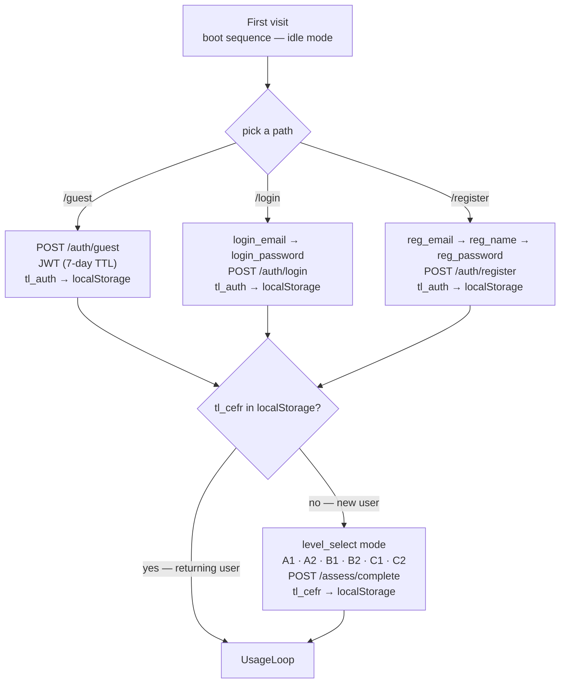
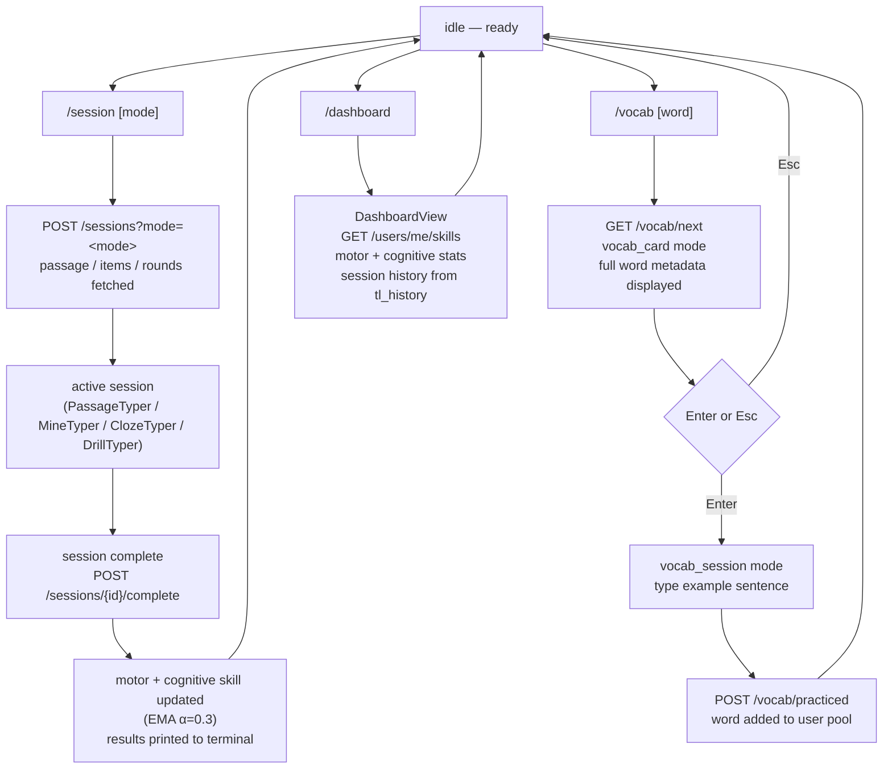
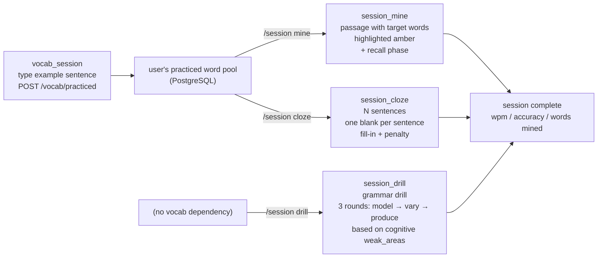
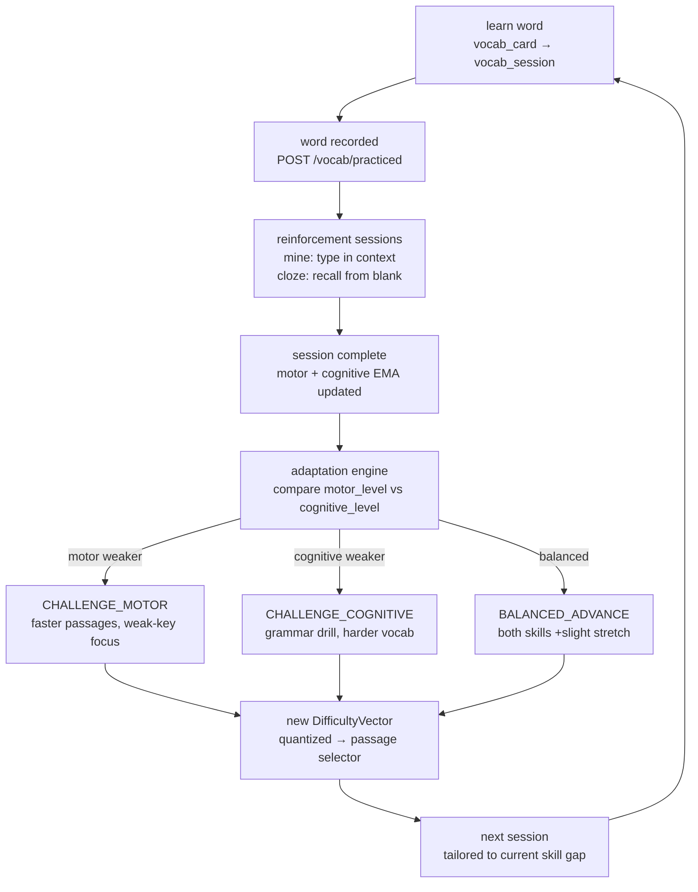
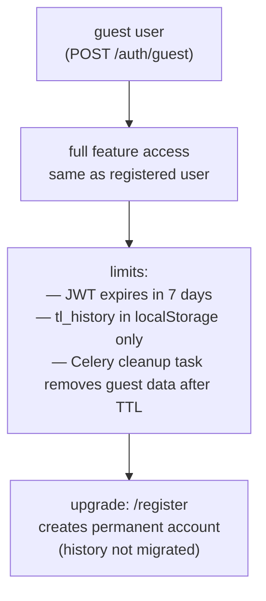

# User Journey

End-to-end flows from first visit through the three auth paths, level selection gate, and the core usage loop connecting sessions, vocab learning, and skill adaptation.

## First visit: three auth paths

## Core usage loop

## How the three session modes connect to vocab learning

## Learning feedback loop

## Guest path constraints

